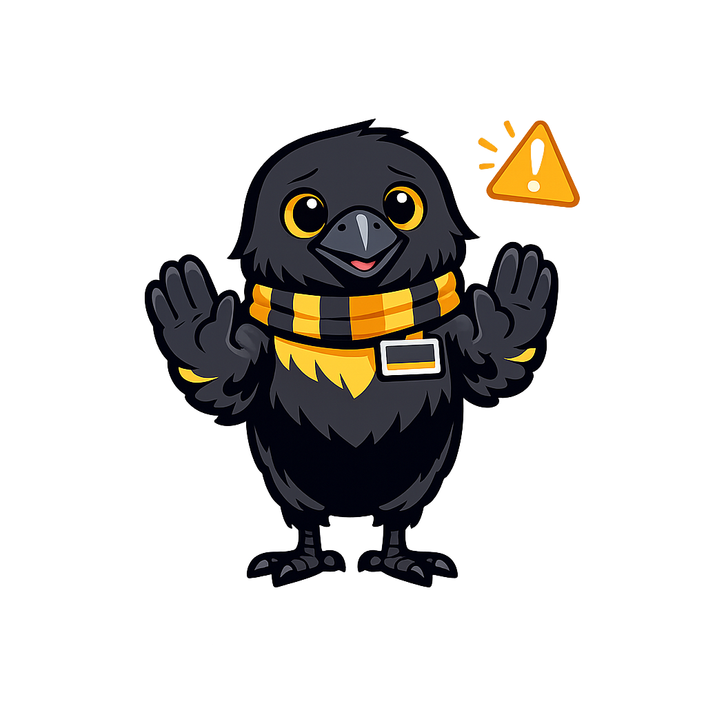

# Team Formation and Roles

## Summary

This chapter covers why diverse founding teams consistently outperform solo founders and how to build one starting from your existing St. Olaf network. You will explore the builder/seller/visionary role triad, practice pitching your idea to potential co-founders, and learn the basics of co-founder agreements, equity splits, and conflict resolution. By the end of this chapter, you will have identified at least one potential collaborator and drafted a rough co-founder conversation plan.

## Concepts Covered

This chapter covers the following 14 concepts from the learning graph:

1. Communication Skills
2. Collaboration
3. Team Formation
4. Team Diversity
5. Complementary Skills
6. Builder Role
7. Seller Role
8. Visionary Role
9. Co-Founder Pitch
10. Co-Founder Agreement
11. Team Communication
12. Role Definition
13. Skill Gap Analysis
14. Equity Split

## Prerequisites

This chapter builds on concepts from:

- [Chapter 1: Ikigai and Self-Discovery](../01-ikigai-and-self-discovery/index.md)
- [Chapter 4: Value Propositions](../04-value-propositions/index.md)

---

There is a scene that plays out every semester at the Ole Cup: two students who have been working on a venture together for months show up to the final round, present brilliantly, and then — when a judge asks "who does what on your team?" — both of them answer at the same time and say the same thing.

They are both the visionary. Neither of them is the builder. Nobody is actually selling anything.

This is not an unusual situation. It is, in fact, the most common founding team problem at the student level, and it is avoidable — but only if you are intentional about team composition before you are already six months into building with the wrong people.

The research on this is consistent and clear: diverse founding teams with complementary skills outperform single-founder ventures on virtually every metric that matters over a multi-year time horizon — survival, growth, innovation, and resilience under stress. This chapter is about building that team deliberately, starting from the campus community you already have.

!!! mascot-welcome "Chapter 7: The team is the venture at this stage"
    
    At the Ole Cup stage, judges are often evaluating the team as much as the idea — because ideas pivot, but people compound. This chapter gives you the framework for building a team that impresses judges not by how many people are on it, but by how well each person's strengths fill a gap the others leave. Your Ikigai is waiting — let's find it!

## Why Teams Beat Solo Founders

The data on solo founders versus founding teams is not ambiguous. Research from Harvard Business School, First Round Capital, and multiple startup accelerators consistently finds that ventures with two or three co-founders:

- Raise more capital at better valuations
- Survive longer before running out of money or motivation
- Produce more revenue at the early stages
- Are more likely to reach scale

The reasons are not mysterious. Building a venture requires executing across at least three fundamentally different domains simultaneously: product development or service delivery (the builder function), customer acquisition and communication (the seller function), and strategic direction and stakeholder management (the visionary function). These domains require genuinely different skills, temperaments, and time horizons. The founders who are exceptional at all three exist — but they are rare enough that designing a team around the expectation of finding one is not a realistic strategy.

More importantly, the value of a founding team is not simply additive. Two founders with complementary skills do not produce twice the output of one — they produce more than twice, because the combination creates capabilities that neither has alone. The builder who has a seller challenging their product assumptions ships better product. The seller who has a visionary keeping the long view accessible avoids short-term deals that damage the brand. The visionary who has a builder asking "can we actually build this?" avoids burning six months on an impossible direction.

**Team diversity** — across academic discipline, cultural background, personality type, and skill set — amplifies this effect further. Diverse teams are better at noticing blind spots, generating creative solutions, and representing the range of customers they hope to serve. At St. Olaf, where your network spans art, music, biology, religion, economics, and theater, you have access to unusual team diversity that students at specialized professional schools do not.

## The Builder-Seller-Visionary Triad

The most useful framework for founding team role analysis comes from David Beckett and is sometimes called the "builder/seller/visionary" or "hacker/hustler/designer" triad. The exact language varies, but the underlying structure is consistent: every effective early-stage founding team needs someone who builds the thing, someone who sells the thing, and someone who holds the strategic picture of where the whole enterprise is going.

Before defining each role, a critical clarification: these are **function labels**, not job titles. A two-person team might have one person covering two functions at reduced capacity. A three-person team might split functions differently. The labels describe where each person's primary energy and strongest skills are pointed, not rigid organizational boxes.

| Role | Primary Function | Typical Strengths | Warning Sign of Its Absence |
|---|---|---|---|
| **Builder** | Creates the core product or delivers the service | Technical skills, craft, detail orientation, systematic problem-solving | The venture never ships; the product stays at 80% forever |
| **Seller** | Acquires customers, communicates value, closes deals | Relationship-building, storytelling, resilience to rejection, communication | The product exists but no one is finding it or paying for it |
| **Visionary** | Sets strategic direction, manages external relationships, spots emerging opportunities | Systems thinking, synthesis, long-horizon planning, stakeholder navigation | The venture executes well short-term but keeps missing the larger opportunities |

Most students at St. Olaf can quickly identify which of these most closely describes them — and the exercise is worth doing explicitly, not just intuitively, because our self-assessments tend to overweight what we like doing and underweight what we are actually good at.

A **skill gap analysis** identifies which roles are covered by your current team and which are not. Before recruiting co-founders, map your current team (including yourself) against all three roles. The gaps in your map are the gaps to fill. If you are the visionary and are working alone, finding a builder is your most urgent priority. If you have a builder and a seller but no one holding the strategic picture, you need a visionary — or you need to develop those habits in yourself, deliberately.

!!! mascot-tip "Your major is not your role"
    
    A computer science major is not automatically the builder. A business major is not automatically the seller. A philosopher might be the best visionary in the room. Map the roles to what people *do well and love doing*, not what their transcript says.

#### Diagram: Team Role Analyzer

Interactive Team Role Analyzer — map your founding team against the builder-seller-visionary triad

Type: MicroSim
**sim-id:** team-role-analyzer 
**Library:** p5.js 
**Status:** Specified

**Learning objective:** Students assess their own primary and secondary role strengths and identify skill gaps in their current founding team. (Bloom's Taxonomy: Analyzing)

**Canvas:** 700×520px responsive, redraws on window resize events.

**Layout:**
- Top section: "My Team" — up to 4 row entries, each with a text input for "Name or role" and three slider controls labeled Builder (0–10), Seller (0–10), Visionary (0–10). First row is pre-labeled "Me" and locked. Additional rows appear when the user clicks "Add team member."
- Center section: A triangular radar chart (equilateral triangle) showing the team's aggregate score across the three dimensions. Each vertex is labeled Builder, Seller, Visionary. The area shaded represents the team's current coverage. A second outline in dotted line shows the "ideal balanced team" (all three at 7 or above).
- Bottom section: "Gap Analysis" — a dynamically updated panel showing: the lowest-scoring dimension in bold red ("Your weakest coverage: Seller — average 3.4"), a one-sentence explanation, and a suggested action ("Consider recruiting a team member with strong customer communication experience, someone who energizes around pitching and closing").

**Interaction:**
- Moving any slider updates the radar chart in real time.
- Adding a team member adds a new row and recalculates the aggregate triangle.
- The gap analysis panel updates automatically as values change.
- A "Print / Export" button generates a plain-text team summary.

**Gap thresholds:**
- Below 4 average on any dimension: "Critical gap — this area is significantly under-resourced."
- 4–6 average: "Moderate gap — this area has coverage but may need reinforcement."
- 7+ average: "Well covered — this dimension has strong representation."

**Responsive design:** Recalculate and redraw on window resize. Minimum canvas width: 320px. At widths below 500px, replace radar chart with a horizontal bar chart showing three bars (Builder, Seller, Visionary).

**Accessibility:** All sliders are keyboard-controllable. The gap analysis text is the primary information delivery mechanism (the chart is supplemental).

## The Co-Founder Pitch

Finding a potential co-founder is not a passive process. At St. Olaf, the most effective approach is direct, personal, and specific — which is exactly the opposite of posting a generic "looking for co-founder" flyer in Buntrock Commons.

The **co-founder pitch** is a short, honest description of your venture idea, why you are working on it, and what specific skills and perspective you are looking for in a partner. It is not a pitch deck. It is a conversation opener that shares enough to be compelling and asks enough to start a real dialogue.

A good co-founder pitch conversation covers:

1. **The problem and your connection to it.** Not "I want to build an app for athletes" — the full version from your Ikigai: why you, why this problem, what you know from the inside.

2. **What you have done so far.** The experiments you have run, the customers you have talked to, the validated learning you have. This demonstrates that you are serious and that the idea has moved past the "I have a great idea" stage.

3. **What you are specifically looking for.** Not "someone passionate" — a specific function. "I need someone who can build a React Native app and who wants to be in the room for customer conversations." Specificity signals self-awareness and makes it easy for the right person to say yes.

4. **What you are offering.** A real equity stake, a serious time commitment, and the expectation of mutual co-founder rights. Anyone worth having as a co-founder will want to know they are a real partner, not a hired hand.

The best places to have this conversation at St. Olaf: the Piper Center for Vocation and Career's entrepreneurship events, the Creative Makerspace, DiSCO (the digital scholarship center), any class where a compatible skill set is being developed, and the direct personal networks that liberal arts campuses are unusually good at creating.

## Co-Founder Agreements and Equity Splits

The co-founder agreement is the document most founding teams wish they had written six months earlier than they did. It is not a legal formality — it is a clarity tool that surfaces assumptions both parties hold before those assumptions turn into conflict.

A **co-founder agreement** (sometimes called a founders' agreement) covers the minimum set of topics that, if left undiscussed, routinely destroy otherwise viable ventures:

- **Roles and responsibilities:** Who is responsible for which functions? What decisions require mutual agreement, and what can each founder decide independently?

- **Equity split:** What percentage of the company does each founder own? This is the most emotionally charged conversation in early-stage founding, and it is much better to have it awkwardly at the beginning than catastrophically later.

- **Vesting schedule:** Does ownership vest over time, contingent on continued work? The standard is a four-year vesting schedule with a one-year cliff — meaning a founder who leaves in the first year gets nothing, and a founder who leaves after three years gets 75%. Vesting protects the team from someone departing after six months but keeping their equity.

- **Intellectual property assignment:** Does the IP created in service of the venture belong to the venture, not to the individual founder who created it? Without this, the founder who wrote the code technically owns the code.

- **Decision rights for major decisions:** What requires a unanimous vote? What requires a majority? What can a single founder decide alone?

**Equity split** is the most common source of co-founder conflict, and the most common mistake is splitting equity equally without having an explicit conversation about contribution, role, and commitment level. Equal splits are sometimes right — when contributions are genuinely equal and commitment is symmetric. But many equal splits are done to avoid an uncomfortable conversation, and the discomfort surfaces later, compounded, when one founder is working 20 hours per week more than the other and owns the same percentage of the company.

The most practical approach for student teams: use a dynamic equity model for the first semester (sometimes called the "slicing the pie" method, from Mike Moyer), where each founder's equity accrues based on actual contributions of time, money, and assets. This avoids the premature crystallization of shares before anyone knows what the venture will actually need.

**Team communication** norms — how often the team meets, how decisions are documented, how disagreements are resolved — deserve the same explicit attention as equity. Two-person founding teams that never have a direct conversation about what happens when they disagree eventually have a direct conversation about what happens when they disagree — but usually at the worst possible moment.

!!! mascot-warning "The hardest conversation to have is the one to have first"
    
    Avoiding the equity conversation because it feels awkward is the founding team equivalent of not looking at your bank balance because it makes you anxious. The number does not change by not looking. The awkwardness compounds by not talking. Have the conversation in the first week.

## Collaboration and Role Definition

Once your team is assembled, the work shifts from finding the right people to building the right working culture. **Role definition** — explicit, agreed-upon clarity about who owns which decisions, which deliverables, and which relationships — is the infrastructure of effective team collaboration.

At the student level, role definition often gets skipped because the team is small and informal, and everything feels flexible. This is a feature of small teams that becomes a bug fast: when everyone is responsible for everything, the tasks that fall through the cracks are the ones nobody noticed they had implicitly assigned to themselves. Explicit role ownership turns "someone should do this" into "Alex does this."

**Collaboration** at the founding team level is not the same as collaboration in a group project. In a group project, the stakes are graded equally and the timeline is fixed. In a founding team, the stakes are asymmetric (the company succeeds or it does not) and the timeline is open. This requires more direct communication, more explicit feedback norms, and more willingness to have the difficult conversations early.

**Communication skills** — specifically, the ability to give direct feedback, receive it without defensiveness, and escalate concerns before they become crises — are the most underrated founding team asset. The St. Olaf emphasis on oral and written communication, reflection, and rhetoric turns out to be unusually good preparation for this.

## Try It

1. **Self-Assessment: Your Primary Role.** Rate yourself honestly on each of the three dimensions (Builder, Seller, Visionary) from 1–10 based on demonstrated ability, not preference. Ask one person who knows you well to do the same rating for you. Compare the results. Note any gaps between self-perception and outside observation.

2. **Team Skill Gap Analysis.** Using the Team Role Analyzer above, map your current team. Identify the most significant gap. Write a paragraph describing the specific skills and temperament you would look for in a team member to fill that gap.

3. **Draft a Co-Founder Pitch.** Write a two-paragraph co-founder pitch for your venture: the first paragraph covers the problem, your connection to it, and what you have done so far; the second covers exactly what you are looking for and what you are offering. Read it to yourself out loud — if you would not say it in a real conversation, revise it until you would.

4. **Reach Out to One Person.** Identify one person in your St. Olaf network who might fill a gap on your team. Send them a message or have a 15-minute coffee conversation using your co-founder pitch. Document what you learned — whether they are interested or not, and what their reaction tells you about how to refine your pitch.

5. **Draft a Co-Founder Agreement Outline.** Using the five categories above (roles, equity, vesting, IP, decision rights), write one to three bullets per category describing what your current team has agreed to (or what you would propose to agree to). Identifying the unresolved items is as valuable as filling in the resolved ones.

!!! tip "Ole Cup Connection"
    The Ole Cup application includes a team section that asks each member to describe their role and the specific skills they contribute. Judges score this section on complementarity — does the team cover the necessary functions? — not on the number of team members or the impressiveness of individual credentials. A two-person team with clearly complementary roles (builder + seller, or visionary + builder with specific domain expertise) will score higher than a four-person team where everyone describes themselves as a leader. The team role analysis and co-founder conversation work in this chapter maps directly onto that section.

!!! mascot-celebration "Finding the right team is harder than finding the right idea — and you just started"
    
    You now have a framework for building a team around complementary roles rather than compatible personalities alone, and a template for having the co-founder conversations that most teams avoid until they cannot. In Chapter 8, we zoom out from the team to the full business model and map how all the pieces of your venture — customers, channels, revenue, costs — fit together on a single page.
