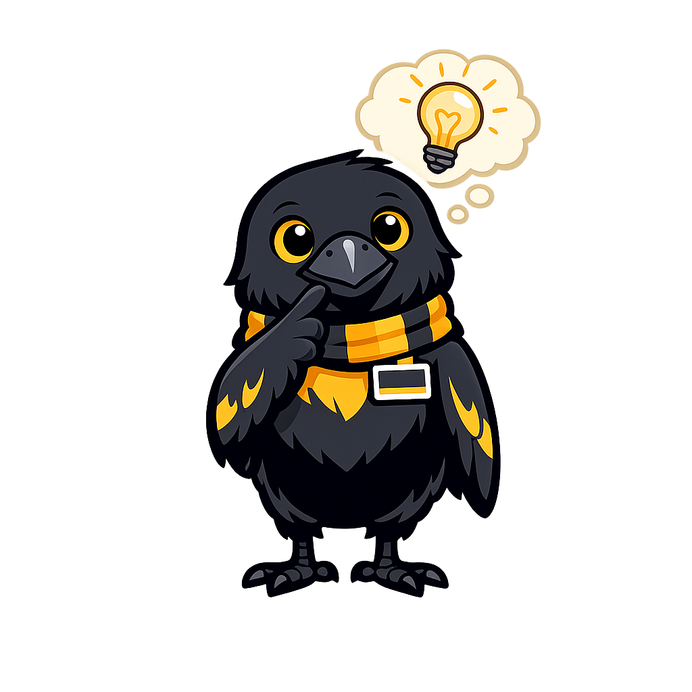

# Business Model Canvas

## Summary

This chapter walks through all nine building blocks of the Business Model Canvas — the one-page strategic tool that shows how every part of your venture fits together and makes money. You will complete a canvas for your own venture, learn how channels, customer relationships, and revenue streams interact, and practice iterating the canvas as new information arrives from customer feedback. By the end of this chapter, you will have a first-draft Business Model Canvas ready to refine with your team.

## Concepts Covered

This chapter covers the following 13 concepts from the learning graph:

1. Business Model
2. Business Model Canvas
3. Revenue Streams
4. Channels
5. Customer Relationships
6. Key Resources
7. Key Activities
8. Key Partnerships
9. Cost Structure
10. Direct Channels
11. Indirect Channels
12. Customer Acquisition
13. Customer Retention

## Prerequisites

This chapter builds on concepts from:

- [Chapter 4: Value Propositions](../04-value-propositions/index.md)
- [Chapter 6: Social Ventures and Impact](../06-social-ventures-and-impact/index.md)
- [Chapter 7: Team Formation and Roles](../07-team-formation-and-roles/index.md)

---

At some point in the Ole Cup mentoring phase, every team gets the same question from their mentor. It does not matter what industry the venture is in, how sophisticated the product is, or how many customers the team has already talked to. The question is always some version of:

"How does this actually make money?"

This is not a hostile question. It is a genuine request to understand whether the team has thought through how all the moving pieces of their venture — customers, delivery, costs, revenue — fit together into something that could sustain itself over time. Most teams stumble here not because their idea is bad, but because they have been thinking about one piece at a time and have never stood back to look at the whole system at once.

The **Business Model Canvas** is the tool that forces you to look at the whole system at once. Developed by Alexander Osterwalder and introduced in the book *Business Model Generation* (co-authored with Yves Pigneur), the canvas maps nine building blocks of any business onto a single page. Filling it in — for real, with honest answers, not aspirational ones — is one of the most clarifying exercises available to an early-stage founder.

!!! mascot-welcome "Chapter 8: The one-page view of everything"
    
    A business model is not a financial projection. It is the logic of how your venture creates value, delivers it, and captures enough of it to survive. The canvas maps that logic on a single page — and when one block changes, you can see immediately which other blocks need to change too. Let's fill yours in.

## What a Business Model Is (and Is Not)

A **business model** is the description of how an organization creates, delivers, and captures value. It is not a financial projection, a marketing plan, or a mission statement — it encompasses all of these by answering the underlying question: "How does this whole thing actually work?"

Before defining the nine building blocks, it helps to understand how they relate to each other. The canvas is divided into three zones:

- **Right side (customer-facing):** Value Propositions, Customer Segments, Channels, Customer Relationships, Revenue Streams — the front of the business, where you interact with customers and generate income.
- **Left side (operations-facing):** Key Activities, Key Resources, Key Partnerships, Cost Structure — the back of the business, what you need to execute on what you promise customers.
- **Center:** Value Propositions — the bridge that connects the front and back.

This three-zone structure reveals something important: a business model problem can live anywhere on the canvas. A venture with a brilliant product but a broken channel is not more viable than a venture with a great channel and a weak product. Every block needs to work, and they need to work together.

## The Nine Building Blocks

A clear understanding of each block is essential before filling in the canvas. The blocks are introduced here in the order that produces the most coherent thinking — starting with the customer side, moving to the center, then addressing the operational side.

### 1. Customer Segments

**Customer segments** are the groups of people or organizations your venture creates value for and serves. This is not "everyone who might benefit" — it is the specific, reachable subset of potential customers who share enough in common that they can be served with a single value proposition and reached through the same channels.

Customer segments are defined not by demographics alone, but by shared problems, behaviors, or needs. "College athletes" is not a segment — it is a demographic. "Division III varsity athletes at liberal arts colleges who receive less than 24-hour coaching feedback on game film" is a segment, because these people share a specific pain point that a single offering could address.

Multiple customer segments are possible — especially for platforms and marketplaces, which often serve both supply-side and demand-side customers simultaneously. But each additional segment requires its own value proposition, channel, and relationship strategy. Start with one segment, understand it deeply, and expand only when the first segment is served well.

### 2. Value Propositions

The **value proposition** is what you have been building toward since Chapter 4: the bundle of products and services that creates value for a specific customer segment. On the canvas, value propositions describe which customer pains you relieve and which gains you create, using what specific offering.

One canvas typically has one primary value proposition per customer segment. If you are serving multiple segments, you have multiple rows in this block.

### 3. Channels

**Channels** are how you reach your customers — how you communicate your value proposition, how you deliver the product or service, and how you support customers after purchase. Channels can be direct (owned by your venture) or indirect (operated by partners), and they can be physical or digital.

**Direct channels** include your own website, mobile app, sales team, physical store, or social media presence. You control the experience and keep the full margin, but you bear the full cost of building and operating the channel.

**Indirect channels** include retailers, distributors, affiliate partners, app marketplaces, and referral networks. You reach customers through someone else's existing infrastructure, which reduces your cost and time but also reduces your margin and control.

At the student founder stage, channels are often the most underdeveloped block on the canvas — because it is easy to build a product and hard to systematically find customers for it. Be honest here: who will your first 100 customers be, and how will they actually discover you?

**Customer acquisition** is the process of converting potential customers into actual customers through your channel strategy. **Customer retention** is the process of keeping customers once acquired — making sure they return, renew, refer, or expand their use of your offering.

### 4. Customer Relationships

**Customer relationships** describe the type of relationship your venture establishes with each customer segment. The range includes automated self-service (no human contact — the product serves itself), personal assistance (a dedicated human being for each customer), community (customers help each other), and co-creation (customers actively participate in creating value, as in user-generated content platforms).

The right relationship type depends on your customer segment, your channel, and your cost structure. Personalized, human relationships are more expensive but create more loyalty and better feedback. Automated relationships are scalable but can feel impersonal. For a student venture with limited resources, the temptation is always to automate everything — but early-stage ventures often benefit from intentionally high-touch relationships with their first customers, because those relationships produce the learning that automated systems cannot.

### 5. Revenue Streams

**Revenue streams** are how your venture generates income from each customer segment. Before the financial chapter (Chapter 9), a few critical definitions:

A **revenue stream** is not the same as a **revenue model** — a stream is a specific source of income (e.g., "monthly subscription fees from student athletes"), while a model is the overall structure (e.g., "subscription"). A venture can have multiple streams with a single underlying model, or multiple streams with different models.

Common revenue stream types for student ventures:

- **Transaction fees** — a one-time payment each time a customer buys a product or uses a service
- **Subscription fees** — recurring payments for ongoing access
- **Usage fees** — customers pay per use (per hour, per transaction, per unit)
- **Licensing fees** — customers pay to use intellectual property you created
- **Advertising revenue** — a third party pays to reach your audience

The critical discipline here: for each revenue stream, be specific about who pays, how much, how often, and what they are paying for. "Revenue from users" is not a revenue stream — "a $4.99/month subscription paid by varsity athletes for film sharing access" is.

### 6. Key Resources

**Key resources** are the most important assets required to make your business model work — what you need to create the value proposition, reach customers, maintain relationships, and earn revenue. Resources fall into four types: physical (equipment, inventory, facilities), intellectual (patents, brand, data, software), human (specific expertise, relationships, creative skills), and financial (cash, credit, investment).

For most student ventures, the scarcest and most valuable key resource is human — specifically, the knowledge and relationships your founding team possesses. The St. Olaf network (professors, alumni, Piper Center connections, Mayo Innovation Scholars relationships) is a key resource that many student founders significantly underestimate.

### 7. Key Activities

**Key activities** are the most important things your venture must do to make the business model work. For a product company, key activities include design, development, and maintenance. For a service company, they include delivery, coordination, and quality management. For a platform, they include network curation, matching, and fraud prevention.

Key activities are different from everything you do — they are the activities that, if you stopped doing them, the business model would break. Identifying them forces clarity about where your time and resources must actually be concentrated.

### 8. Key Partnerships

**Key partnerships** are the network of suppliers, partners, and other outside parties that make the business model work. The most common partnership motivations are: optimization and economies of scale (doing with a partner what would be too expensive to do alone), risk and uncertainty reduction (sharing risk with a partner in uncertain markets), and acquisition of particular resources and activities (accessing capabilities through a partner that your team does not have).

At the student level, key partnerships are often the block most worth spending time on — because the St. Olaf ecosystem provides access to partnerships that are unusually hard to assemble elsewhere. The relationship between the Piper Center and the Minnesota Cup, the proximity to Mayo Clinic through the Mayo Innovation Scholars program, the DiSCO partnership with digital media industries, and the Lunar Startups connection in the Twin Cities are all potential partnership assets for student ventures that understand how to activate them.

### 9. Cost Structure

**Cost structure** describes all the costs incurred in operating the business model — specifically, the costs of executing key activities, maintaining key resources, and managing key partnerships. Costs can be classified as fixed (incurred regardless of output, like rent or salaries) or variable (change in proportion to output, like materials or transaction fees).

For student ventures, the cost structure exercise is often sobering but productive: it forces founders to confront the gap between what they assume it will cost to operate and what it will actually cost to deliver the value proposition they are claiming. A canvas with a rich value proposition and an implausibly thin cost structure is a canvas that has not been filled in honestly.

!!! mascot-thinking "Every block talks to every other block"
    
    Change the revenue stream and you usually need to change the channel. Change the customer segment and you usually need to change the value proposition. The canvas is not a checklist — it is a system. When one block changes, trace the ripple through at least three other blocks before you stop.

## Completing and Iterating the Canvas

The first draft of your Business Model Canvas will be wrong. This is not a failure — it is the expected result of filling in a canvas before you have fully tested your assumptions. The canvas is valuable not because the first draft is right, but because it makes your assumptions explicit and visible, so that you can test and update them systematically rather than discovering them wrong at the worst possible time.

The recommended sequence for filling in the canvas for the first time:

1. Start with **Customer Segments** — who are you serving?
2. Then **Value Propositions** — what value are you creating for them?
3. Then **Channels** — how will you reach them?
4. Then **Customer Relationships** — what type of relationship will you have?
5. Then **Revenue Streams** — how will you earn money?
6. Then **Key Resources** — what do you need to deliver?
7. Then **Key Activities** — what must you do?
8. Then **Key Partnerships** — who can help you do what you cannot do alone?
9. Last, **Cost Structure** — what will it actually cost?

After completing the first draft, look for internal consistency: does each block actually support the others? The most common inconsistencies to check:

- Does the channel reach the customer segment you described?
- Can your key resources actually support your key activities?
- Is the cost structure sustainable given the revenue streams you described?
- Are your customer relationships appropriate for the segment and channel?

The interactive canvas below lets you fill in all nine blocks and see consistency flags.

#### Diagram: Interactive Business Model Canvas

Interactive Business Model Canvas — complete all nine building blocks and identify consistency issues

Type: MicroSim
**sim-id:** business-model-canvas 
**Library:** p5.js 
**Status:** Specified

**Learning objective:** Students complete a first-draft Business Model Canvas for their venture and identify at least two blocks that are inconsistent or incomplete. (Bloom's Taxonomy: Applying and Evaluating)

**Canvas:** 800×580px responsive, redraws on window resize events.

**Layout:** The standard BMC nine-block grid layout:
- Row 1 (top): Key Partners (far left) | Key Activities (center-left) | Value Propositions (center) | Customer Relationships (center-right) | Customer Segments (far right)
- Row 1b (middle of center blocks): Key Resources (below Key Activities) | Channels (below Customer Relationships)
- Row 2 (bottom): Cost Structure (left half) | Revenue Streams (right half)

Each block is a rounded rectangle with the block name as a small label in the top-left corner and a text area for entry. Blocks are color-coded:
- Customer side (right 3 blocks): light blue
- Value proposition (center): light yellow
- Operations side (left 3 blocks): light green
- Cost and revenue (bottom 2): light gray

**Interaction:**
- Clicking any block expands it to a larger text-entry overlay (full-screen width, 200px tall) with the block name, a brief description of what to enter (one sentence), and a placeholder example.
- Pressing Escape or clicking outside commits the entry and returns to the canvas view.
- A "Check Consistency" button runs five consistency checks and highlights inconsistent block pairs with a red connecting line and a brief tooltip explaining the inconsistency:
  1. Customer Segments and Value Proposition: "Does the VP directly address a pain or gain of this segment?"
  2. Channels and Customer Segments: "Can this channel actually reach the segment described?"
  3. Key Activities and Key Resources: "Are the resources sufficient to execute the activities?"
  4. Revenue Streams and Value Proposition: "Is there a clear line from the VP to what customers will pay for?"
  5. Cost Structure and Revenue Streams: "Is the cost structure sustainable given the revenue streams?"
- A "Save as Text" button exports all nine blocks as a formatted plain-text document.

**Responsive design:** At widths below 700px, switch to a vertical scrollable list of blocks. Each block is a full-width card with its label and text area. Minimum canvas width: 320px.

**Accessibility:** All text entry areas are standard HTML textarea elements. Block labels and descriptions are fully accessible to screen readers.

## Try It

1. **Complete Your First Canvas.** Use the interactive tool above (or a printed canvas from a quick web search) to fill in all nine blocks for your venture. Use real, specific language — not "users" but your specific segment; not "revenue from the app" but the specific stream type, amount, and frequency. Leave no block blank; if you genuinely do not know, write your current best guess and mark it as an assumption.

2. **Find Three Inconsistencies.** After completing your first draft, run the "Check Consistency" check and identify at least three block pairs that do not fully support each other. For each inconsistency, write one sentence explaining what would need to change for the blocks to align.

3. **Map a Competitor's Canvas.** Choose one company that is already operating in your opportunity space — a direct competitor, an adjacent product, or the status quo your customers are currently using. Fill in what you know (or can research) about their nine blocks. Compare to your canvas: where are you differentiated? Where are you trying to do the same thing they are already doing?

4. **Iterate Once.** Based on your consistency check and competitive analysis, revise your canvas. Specifically: change one block (pick the one you feel least confident about) and trace the ripple — what other blocks need to change as a result? Document the change and the reasoning.

!!! tip "Ole Cup Connection"
    The Business Model section of the Ole Cup pitch deck is the slide that reveals whether a team understands their own venture. A common failure mode: a team describes a problem brilliantly, presents a compelling solution, and then hand-waves the business model with "we'll charge a small fee." Judges hear this as "we haven't figured out how this makes money yet." The Business Model Canvas exercise in this chapter gives you the vocabulary and structure to say, specifically, what your revenue streams are, how you reach customers, what it costs to operate, and why the whole system hangs together. That level of specificity is what judges are looking for.

!!! mascot-celebration "Nine blocks filled, one complete picture — that is genuinely more than most teams do"
    
    You now have a one-page view of your entire venture — not perfect, not final, but honest and complete enough to stress-test. In Chapter 9, we go a layer deeper into the financial blocks: revenue models, unit economics, and the one-page financial projection that will make your pitch credible to judges.
