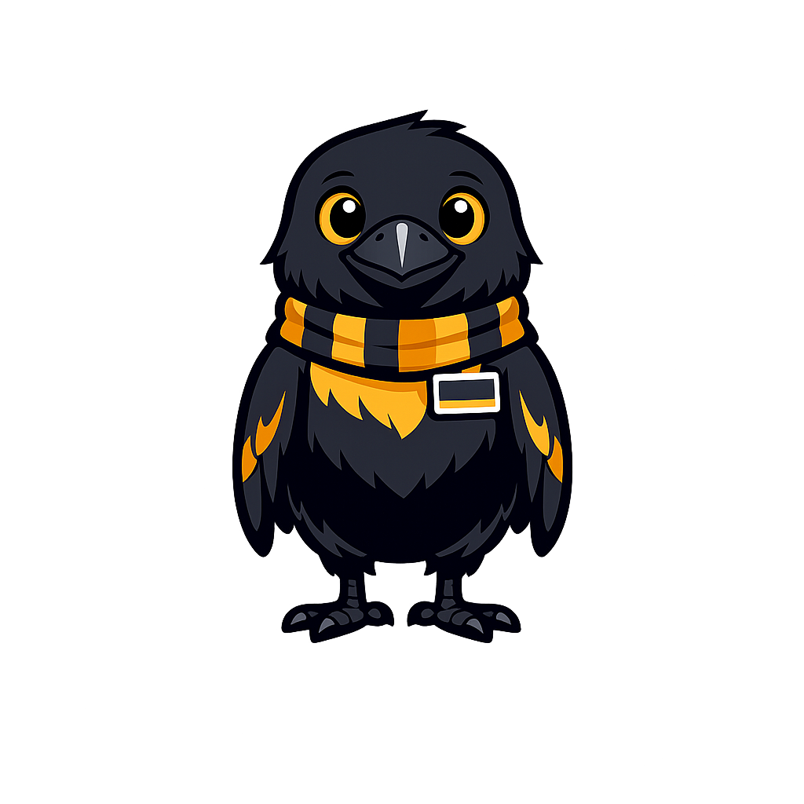
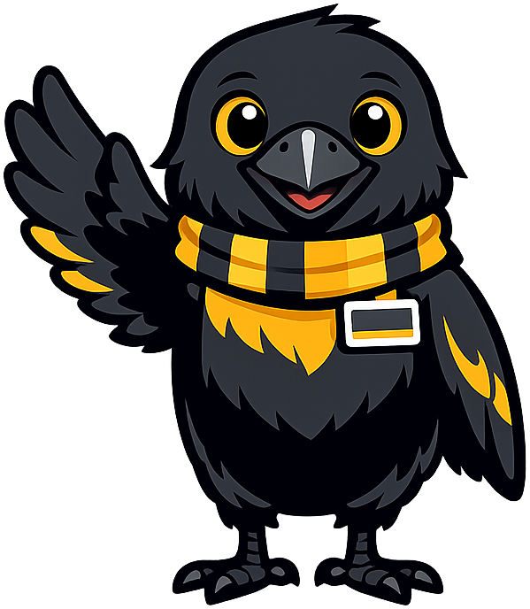
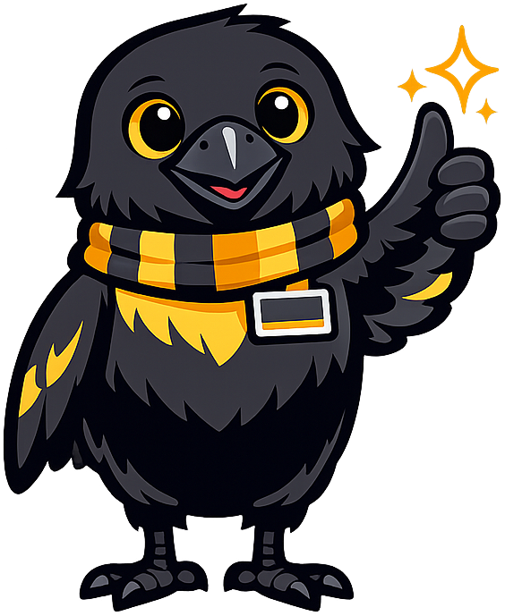

# Mascot Style Guide: Rune the Raven

This page shows all seven mascot admonition styles for reference and visual verification.
Images will appear once the PNG files are generated and placed in `docs/img/mascot/`.

!!! mascot-neutral "A Note from Rune"
    
    This is the **neutral** style, used for general sidebars or introductions where no specific emotional tone is needed.

!!! mascot-welcome "Welcome to the Chapter!"
    
    This is the **welcome** style, used at the opening of every chapter. Your Ikigai is waiting — let's find it!

!!! mascot-thinking "Key Insight"
    
    This is the **thinking** style, used to flag key concepts and important connections students should notice.

!!! mascot-tip "Rune's Tip"
    
    This is the **tip** style, used for hints and helpful advice that keeps students from common stumbles.

!!! mascot-warning "Watch Out!"
    
    This is the **warning** style, used to flag common mistakes and pitfalls before students make them.

!!! mascot-encourage "You've Got This!"
    
    This is the **encouraging** style, used when the content is challenging. Every founder started exactly where you are.

!!! mascot-celebration "Outstanding Work!"
    
    This is the **celebration** style, used at the end of major sections and chapters. Ideas are cheap — curiosity is priceless!
